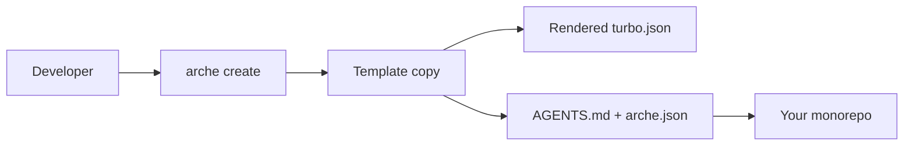
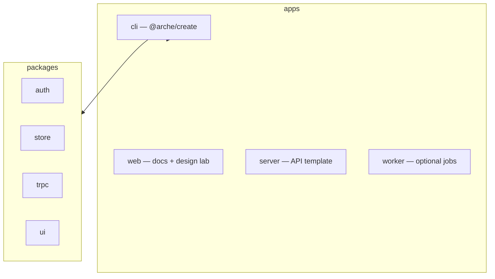

<p align="center">
  <a href="https://arche.kitsunelabs.xyz">
    
  </a>
</p>

<p align="center">
  <a href="https://github.com/KitsuneKode/arche/actions/workflows/ci.yml"></a>
  
  
  
  
</p>

<p align="center">
  <strong>Project origin system</strong> — personal scaffold CLI and template vault for TypeScript monorepos, Rust services, and Solana foundations.
</p>

<p align="center">
  <a href="https://arche.kitsunelabs.xyz">Site</a> ·
  <a href="https://github.com/KitsuneKode/arche">GitHub</a> ·
  <a href="docs/README.md">Docs</a> ·
  <a href="docs/bootstrap-cli.md">CLI</a>
</p>

---

Arche is KitsuneKode’s preset-led way to start real projects without re-wiring the boring parts: workspace shape, package-manager catalogs, agent context, deployment notes, and a reproducible `arche.json`. It began as a full-stack TypeScript template and is now a vault plus `@arche/create` CLI.

**Honest status:** foundations are implemented; preset promotion to “stable” waits on the [verification matrix](.docs/product/verification-matrix.md). No preset is marketed as production-ready until that matrix passes.

## Use the CLI (the fun part)

Published route (after npm release):

```sh
npx arche create my-app
# or
bunx arche create my-app
```

From this repository while developing:

```sh
bun run dev:cli -- my-app --yes --dir=../projects
```

Scaffold **outside** this template repo when writing real output.



### Terminal block (matches the site)

```sh
bun run dev:cli -- my-app --yes --preset=typescript-fullstack --dir=../projects
```

More examples:

```sh
# Interactive
bun run dev:cli -- my-app --dir=../projects

# Rust API
bun run dev:cli -- my-api --yes --preset=rust-api --dir=../projects

# pnpm catalogs
bun run dev:cli -- my-app --yes --preset=typescript-fullstack --pm=pnpm --dir=../projects

# Dry run
bun run dev:cli -- my-app --yes --dry-run --dir=../projects
```

## Presets (pick your fighter)

| Preset                 | Status              | Output today                          |
| ---------------------- | ------------------- | ------------------------------------- |
| `typescript-fullstack` | Requires validation | Next.js + TypeScript API monorepo     |
| `rust-api`             | Requires validation | Axum API, module-first layout         |
| `rust-fullstack`       | Requires validation | Next.js web + `services/api` Rust API |
| `solana-program`       | Requires validation | Planned Anchor `programs/core`        |
| `solana-web`           | Requires validation | Planned web dApp + client             |
| `solana-mobile`        | Requires validation | Planned mobile dApp                   |
| `solana-product`       | Requires validation | Planned web + mobile + program        |
| `customize`            | Requires validation | Explicit composition                  |
| `experiments`          | Experimental        | Opt-in unstable routes                |

## Repository layout



```text
apps/
  cli/       @arche/create CLI
  web/       documentation / marketing + design lab
  server/    TypeScript API template source
  worker/    optional worker template

packages/
  auth/  backend-common/  store/  trpc/  ui/

toolings/
  catalog/   workspace-catalog.json
  scripts/   repo maintenance + brand:export
```

## Development

```sh
bun install
bun run dev:cli -- my-app --yes --dir=/tmp/arche-output
bun test apps/cli/tests
bun run verify:generated
bun run ci
bun run brand:export   # README banner, GitHub icons, OG (needs web build)
```

## Docs grid

| Topic                      | Link                                                                         |
| -------------------------- | ---------------------------------------------------------------------------- |
| Doc index                  | [docs/README.md](docs/README.md)                                             |
| CLI reference              | [docs/bootstrap-cli.md](docs/bootstrap-cli.md)                               |
| Commands                   | [docs/commands.md](docs/commands.md)                                         |
| Deployment hub             | [docs/deployment.md](docs/deployment.md)                                     |
| Env matrix                 | [docs/deployment-env.md](docs/deployment-env.md)                             |
| Verification matrix        | [.docs/product/verification-matrix.md](.docs/product/verification-matrix.md) |
| Rebranding / GitHub assets | [docs/rebranding.md](docs/rebranding.md)                                     |

## Design lab (not a secret base)

Unlinked previews live at `/__design-lab` — `noindex`, excluded from the sitemap, not auth-gated. Fine for experiments; don’t treat it as private infrastructure.

---

<p align="center">
  Built by <a href="https://kitsunekode.in">KitsuneKode</a> ·
  <a href="https://arche.kitsunelabs.xyz">arche.kitsunelabs.xyz</a>
</p>
