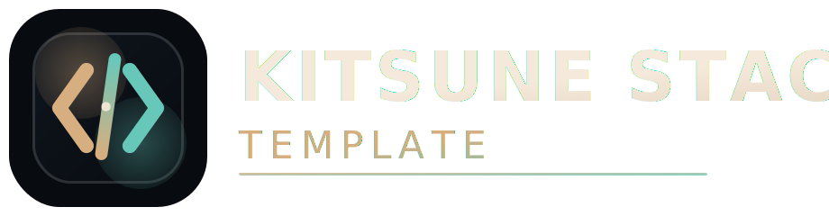

<p align="center">
  
  
  
  
  
</p>

<p align="center">
  
</p>

<h1 align="center">Next.js × Express × tRPC × Bun × Better Auth × Prisma × Turborepo Template</h1>

<p align="center">
  <b>Kickstart your next project with a modern, scalable, and type-safe monorepo template.</b><br/>
  <i>Production-ready, batteries included, and easy to extend.</i>
</p>

---

## 🧪 Use this template

```sh
bun create turbo@latest --example https://github.com/KitsuneKode/template-nextjs-express-trpc-bettera-auth-monorepo
cd my-app
bun install
bun dev
```

> Requires Bun: [Bun](https://bun.sh)

## 🔗 Repository

- GitHub: [KitsuneKode/template-nextjs-express-trpc-bettera-auth-monorepo](https://github.com/KitsuneKode/template-nextjs-express-trpc-bettera-auth-monorepo)

---

## 🚀 Features

- **Full-Stack Ready:** Next.js frontend, Express backend, tRPC for typesafe APIs.
- **Ultra-Fast Tooling:** Powered by Bun for rapid installs and scripts.
- **Type Safety:** End-to-end TypeScript, including API contracts.
- **Modular Auth:** Plug-and-play authentication package.
- **Reusable UI:** Shared component library for consistent design.
- **Monorepo Power:** Code sharing and easy scaling with Turborepo.
- **Production Best Practices:** Pre-configured for real-world deployments.

---

## 🗂️ Project Structure

```text
apps/
  api/        # Express backend (tRPC, Auth, Prisma)
  client/     # Next.js frontend (tRPC client, UI)
packages/
  auth/       # Authentication logic(better-auth)
  store/      # Prisma schema & DB access
  trpc/       # tRPC routers & helpers
  ui/         # Shared UI components
  common/     # Shared types & utilities
  backend-common/ # Backend-specific shared code
```

---

## ⚡ Quick Start

1. **Install dependencies (with Bun):**

   ```sh
   bun install
   ```

2. **Start development (all apps/packages):**

   ```sh
   bun dev
   ```

3. **Build everything:**

   ```sh
   bun run build
   ```

4. Add shadcn component to your app

   ```sh
   bunx --bun shadcn@latest add <component-name> --c apps/web
   ```

5. Audit and clean the starter when you begin product work

   ```sh
   bun run repo:doctor
   bun run template:clean:dry
   ```

6. Commit with the enforced Conventional Commit format

   Example: `feat(auth): add google provider`

---

## 🛠️ Why Use This Template?

- **Easy Initial Setup:** Get started in minutes, not hours.
- **Type-Safe Everywhere:** No more guessing types between client and server.
- **Scalable & Maintainable:** Modular structure for growing teams and projects.
- **Modern Stack:** Stay up-to-date with the latest best practices.
- **Ready for Production:** Sensible defaults and extensible configuration.

## 🧹 Starter Hygiene

- `bun run repo:doctor` audits stale scaffolding, broken package exports,
  placeholder files, and doc drift.
- `bun run template:clean:dry` previews the opinionated cleanup plan for teams
  that want to strip demo and template baggage quickly.
- `bun run template:clean` applies that cleanup plan.
- `bun run commit:check` validates the latest commit message.

---

## 📚 Learn More

- [Next.js](https://nextjs.org/)
- [Express.js](https://expressjs.com/)
- [tRPC](https://trpc.io/)
- [Bun](https://bun.sh/)
- [Prisma](https://prisma.io/)
- [Turborepo](https://turbo.build/)
- [Better Auth](https://better-auth.com/)

---

## 📝 Author

- [@KitsunKode](https://x.com/KitsunKode)

---

## 📄 License

MIT

---

> Want to contribute? Add badges, contribution guidelines, or a screenshot/demo section!
